<!-- README Aura animated SVG header -->



<p align="center">
  <a href="https://github.com/noorahmad-dev"></a><a href="https://linkedin.com/in/noorahmad00"></a><a href="mailto:noorahmad.dev00@gmail.com"></a>
</p>


## Transmission: About Me

> Incoming signal from **Lahore, Pakistan**

I'm a Computer Science student and Full-Stack Developer building software that actually ships: AI legal research, RAG pipelines, interactive 3D experiences, computer vision tools, marketing platforms, and Unity games.

I build products **end to end** - interface, backend, database, authentication, deployment, and polish. From the first commit to the final orbit.

## Constellation of Highlights

* Built **Qanoon**, an AI legal research assistant grounded in **1,000+ Pakistani statutes**
* Implemented RAG pipelines with vector embeddings, semantic search, and Postgres vector storage
* Created a fully explorable **3D solar-system portfolio** with Three.js and React Three Fiber
* Built a 2D floor plan to 3D visualization workflow using OpenCV and CNN-based recognition
* Built Unity projects including a shipped 2D coloring game with mobile-optimized fill mechanics



## Missions Launched

| Mission | Objective | Propulsion | Status |
|---|---|---|---|
| **Qanoon** | AI legal research assistant for Pakistani law with cited statute-backed answers | Next.js, RAG, Supabase, Vector Search, Vercel | [In Orbit](https://legal-rag-assistant-two.vercel.app/) |
| **3D Space Portfolio** | Explorable 3D solar system - a glowing sun, orbiting planets, and fly-to camera transitions | Next.js, Three.js, React Three Fiber | [In Orbit](https://interactive-3js-portfolio.vercel.app/) |
| **2D Floor Plan to 3D** | Converts residential floor plans into interactive 3D walkthrough visualizations | OpenCV, CNNs, 3D Visualization | [In Orbit](https://fypwebsite-black.vercel.app/) |
| **TradeRank** | Marketing platform for local service businesses with dashboards and lead flows | Next.js, Tailwind CSS, SEO | In Orbit |
| **2D Coloring Game** | Interactive Unity coloring game with fill-in mechanics and palette selection | Unity, C# | [In Orbit](https://play.unity.com/en/user/59fc24ac-5cec-4c94-b9f7-1c71ca3e973d) |

<details>
<summary><strong>Open Mission Control Console</strong></summary>

<br />

```bash
$ ssh noor@dev-station
> establishing uplink... [OK]
> booting profile.os v2.0... [OK]

PILOT    : Noor Ahmad
STACK    : Next.js | RAG | Three.js | Unity | OpenCV
DATABASE : Postgres + pgvector
FOCUS    : useful products, clean systems
STATUS   : BUILDING

current trajectory:
- AI legal research tools for Pakistani law
- 2D floor plan -> 3D visualization workflows
- Interactive 3D web experiences with React Three Fiber
- SEO-focused marketing platforms and dashboards

signal strength: 100%
```

</details>

<details>
<summary><strong>Crew Log: Education</strong></summary>

<br />

**Bachelor of Science in Computer Science (BSCS)** `2022 - 2026`

* Qarshi University, Pakistan

**Intermediate - FSc Pre-Engineering** `2020 - 2022`

* Govt. College Shah Hussain, Chung, Lahore

</details>

<details>
<summary><strong>Ask Me About (open comms channel)</strong></summary>

<br />

RAG | Next.js | React | Three.js | Supabase | Firebase | Postgres | OpenCV | Unity | C# | AI-assisted development | turning raw ideas into deployed products

</details>


## The Tech Nebula

<h4>Languages</h4>
<p>
  
  
  
  
  
  
  
</p>

<h4>Frameworks & Engines</h4>
<p>
  
  
  
  
  
  
</p>

<h4>Data & Deployment</h4>
<p>
  
  
  
  
  
  
</p>

## Telemetry: GitHub Stats

<p align="center">
  
</p>

<p align="center">
  
</p>

## The Cosmic Snake

<p align="center">
  
</p>


## Establish Contact

<p align="center">
  <a href="https://github.com/noorahmad-dev"></a><a href="https://linkedin.com/in/noorahmad00"></a><a href="mailto:noorahmad.dev00@gmail.com"></a>
</p>

<p align="center">
  <em>From Earth with code - if a mission caught your eye, drop a star. It helps the constellation grow.</em>
</p>

<!-- GALACTIC FOOTER -->


